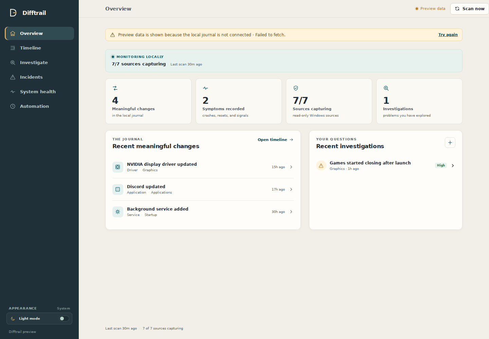

# Difftrail

[](https://github.com/ravenflake/Difftrail/actions/workflows/ci.yml)
[](https://github.com/ravenflake/Difftrail/releases/latest)
[](LICENSE)

Difftrail is an open-source, Windows-first, local-first change journal and
evidence-backed incident investigator. It answers:

> My PC was fine yesterday. What changed?

Windows troubleshooting often starts after the useful context has disappeared:
an update, driver replacement, service change, or device transition happened,
then the crash or failure appeared later. Difftrail keeps a quiet local history
of those meaningful changes so a user can compare an incident with what actually
changed around its onset.

The core diagnostic engine is deterministic and works without AI, an account,
cloud access, or network upload. SQLite is the local source of truth. Difftrail
does not collect screenshots or document contents and does not automatically
change Windows settings.

The current MVP focuses on one useful loop:

1. Build a quiet baseline from read-only Windows snapshots.
2. Record meaningful changes instead of raw telemetry.
3. Ingest crash, hang, reset, restart, and shutdown symptoms.
4. Let a user describe a problem and choose its onset.
5. Rank candidate changes with reproducible evidence signals.
6. Show supporting evidence, counter-evidence, a conservative next step, and a read-only Windows diagnostic target.

Normalized change history is kept locally for diagnosis. Raw Event Log message text is retained for the configured retention period (30 days by default) and then removed while the compact symptom event remains.

> [!IMPORTANT]
> **Project status:** Difftrail is an early pre-1.0 MVP. The current release is
> usable for local exploration and the automated Windows installer path is
> tested in CI, but real-world diagnostic accuracy, multi-day watcher evidence,
> and installed-runtime field validation remain open work. See the
> [roadmap](ROADMAP.md) and [v0.1.4 validation gate](docs/v0.1.4-field-validation.md).

## Quick start

### Install the current Windows release

Download `Difftrail_0.1.3_x64-setup.exe` from the
[latest GitHub release](https://github.com/ravenflake/Difftrail/releases/latest),
install it for the current user, launch Difftrail, and run the initial scan to
create a quiet baseline.

The installer is not currently code-signed, so Windows may show an unrecognized
publisher warning. Download it only from the repository's GitHub Releases page.
Tagged releases after v0.1.3 also include `SHA256SUMS.txt` for artifact
verification. Download both files, run
`Get-FileHash .\Difftrail_*_x64-setup.exe -Algorithm SHA256`, and compare the
reported hash with the checksum file before installing.

### Try the deterministic engine from source

Python 3.11+ is enough for the local engine; it has no third-party Python runtime dependencies. The live collector, Windows Event Log reader, and scheduled watcher require Windows. The deterministic tests and fixture validation can run without a live Windows host.

For an isolated checkout environment:

```powershell
python -m venv .venv
.\.venv\Scripts\python.exe -m pip install -e .
```

The commands below can then use either `python` from an activated environment or `.\.venv\Scripts\python.exe` explicitly.

```powershell
python -m difftrail --db .\difftrail.db seed-demo
python -m difftrail --db .\difftrail.db timeline
python -m difftrail --db .\difftrail.db investigate "My graphics started crashing after an update" --subsystem graphics
```

When `--onset` is omitted, an investigation treats the problem as happening now and includes changes from the preceding lookback window. Supply an ISO timestamp when investigating a historical incident.

On Windows, the default database is `%LOCALAPPDATA%\Difftrail\difftrail.db`; pass `--db` to use another SQLite file. The database is local and is the source of truth for the journal, investigations, feedback, and automation state.

The local engine is usable through the CLI, and the Windows desktop interface is included under `ui/`.

## Desktop interface

The interface is a React/Vite front end in a lightweight Tauri shell. React owns presentation and interaction; the Python engine remains the source of truth behind a loopback-only JSON adapter. The UI never opens SQLite directly, and the adapter omits raw evidence details before data crosses into the browser.



_The built-in synthetic preview is shown here; it contains no host data._

Desktop development additionally requires Node.js 20+, Rust stable, and the Windows build tools required by Tauri.

From the repository root, install the Python package as above, then start the desktop app:

```powershell
Set-Location .\ui
npm ci
npm run desktop:dev
```

This starts Vite, the Tauri window, and a local Difftrail API on an available loopback port. The desktop shell uses the database at `%LOCALAPPDATA%\Difftrail\difftrail.db`. Set `$env:DIFFTRAIL_PYTHON` to an explicit interpreter path when the `python` command should not be used.

For browser-only UI work, run the API and Vite separately:

```powershell
python -m difftrail --db "$env:LOCALAPPDATA\Difftrail\difftrail.db" ui --port 45917
Set-Location .\ui
npm run dev
```

Then open `http://127.0.0.1:5173`. Port `45917` is the standalone API default;
for the desktop app, Python binds a dynamically assigned loopback port and
reports that owned port to the Tauri shell through its private startup pipe. If
the API is unavailable, the UI uses a clearly labelled safe preview dataset so
the layout can still be inspected; scans, investigations, feedback, and
automation controls require the local API.

The installed Tauri app creates a fresh API token for every launch. For
standalone browser development, set `DIFFTRAIL_API_TOKEN` for the Python process
and `VITE_DIFFTRAIL_API_TOKEN` for Vite to the same random value of at least 32
characters when token-protected behavior needs to match the installed app.

The current interface includes Overview, Timeline, Investigate, Incidents, System health, and Automation. The important user path is: review meaningful changes, describe a symptom, inspect ranked evidence and counter-evidence, then optionally label whether a candidate was useful. The UI does not claim causality beyond the deterministic evidence available in the local journal. Appearance follows the Windows system theme by default; the Appearance control can set a persistent light/dark preference or return to system behavior.

The desktop shell keeps navigation and top-level status chrome fixed while the main content column scrolls.

A Windows current-user NSIS installer can be built from `ui` with `npm run desktop:build`, and pull requests build it in the Windows CI job. From the repository root, install the optional backend build tool first:

```powershell
python -m pip install -e ".[build]"
Set-Location .\ui
npm ci
npm run desktop:build
```

The installer packages self-contained PyInstaller backend and watcher executables under the Tauri resource directory. Development mode intentionally launches the checked-out Python engine so the source remains easy to inspect and test. The generated installer is written under `ui\src-tauri\target\release\bundle\nsis\`.

A partial scan prints provider warnings instead of treating missing coverage as a clean result.

For a realistic, safe driver-change test, use a new disposable database. The fixture runs the actual scanner and snapshot diff path with Windows-shaped NVIDIA records, then adds a simulated display-reset symptom; it does not call PowerShell or modify drivers:

```powershell
$simulationDb = Join-Path $env:LOCALAPPDATA "Difftrail\nvidia-switch-simulation.db"
python -m difftrail --db $simulationDb simulate nvidia-driver-switch
python -m difftrail --db $simulationDb investigate "graphics started failing" --subsystem graphics --json
```

The simulation requires an empty database so fixture evidence cannot be mixed with real host history. `seed-demo` remains useful for a quick event-only tour; this fixture is the stronger end-to-end test.

For a real Windows journal, run an initial read-only scan, then enable Background watcher in the desktop Automation screen (or use the installation script below):

```powershell
python -m difftrail --db "$env:LOCALAPPDATA\Difftrail\difftrail.db" scan
```

The foreground `watch` command remains available for CLI diagnostics; the desktop app uses the hidden periodic Task Scheduler worker.

The watcher snapshots applications, Windows updates, installed driver associations, services, scheduled tasks, startup entries, and present devices. The first successful snapshot of each source is a quiet baseline; later durable state transitions become journal events. Driver inventory is independent from live device presence so one disconnect is not reported twice as both a device removal and a driver uninstall. Normal service/task runtime state, healthy device status, and localized app/driver display text are retained as context but do not create changes by themselves. NVIDIA/AMD display-container service package-path changes are classified as graphics evidence, while the Studio/Game Ready branch is not inferred unless Windows exposes explicit branch metadata. Event Log collection covers common application crashes/hangs, display-driver resets, unexpected restarts, and unexpected shutdowns.

The desktop app's Automation screen manages a hidden, periodic Windows Task Scheduler job, runs a scan on demand, stores local notifications for high-value signals and provider warnings, and creates reviewable investigation drafts. Each scheduled run is a short headless worker rather than a visible terminal process; Task Scheduler handles logon startup, missed runs, and restart-on-failure. These automations observe and prepare evidence; they do not change Windows settings or apply remediation.

The installer also starts a lightweight Difftrail companion in the Windows notification area and registers both a per-user Run entry and Startup-folder fallback for the next logon. The companion retries briefly if Explorer is not ready yet, reports whether scheduled collection is enabled, actively scanning, or off, and is self-healed whenever the desktop is opened. Click the status row to toggle background collection, or use the full Automation screen to choose an interval from five minutes (the default) through one day and configure notification rules. Left-click the icon opens the desktop UI. The WebView and local UI API still exit when the main window closes, so the status icon does not carry the desktop application's memory footprint. Right-click the icon for status, open, and explicit exit actions. Exiting the status icon does not disable the independently scheduled watcher.

To start it at logon from a checkout, review the script and run PowerShell as the user who should own the task:

```powershell
.\scripts\install-watcher.ps1 -PythonPath .\.venv\Scripts\python.exe -IntervalSeconds 300
```

If the package is installed into the active system Python, `-PythonPath` can be omitted. The selected interpreter must have a sibling `pythonw.exe`, because the scheduled task runs without opening a console. The script validates the selected interpreter before creating the scheduled task.

Creating a logon task may require administrator approval on Windows. The desktop Automation screen retries through the UAC prompt when Task Scheduler returns `Access is denied`.

Remove only the scheduled task with:

```powershell
.\scripts\uninstall-watcher.ps1
```

Uninstalling the watcher does not delete the local journal.

After a few days of passive collection, build a redacted host-validation report:

```powershell
python -m difftrail --db "$env:LOCALAPPDATA\Difftrail\difftrail.db" validate-host --days 7
python -m difftrail --db "$env:LOCALAPPDATA\Difftrail\difftrail.db" validate-host --days 7 --json
```

The report aggregates scan stability, provider-error counts, change volume, source/subsystem distributions, recorded background-scan footprint, and user-labeled investigation outcomes. It does not include event details, paths, descriptions, raw messages, or process IDs. To record a footprint sample, install the optional validation dependency and run `overhead --record`; this measures a disposable watcher process tree and stores only numeric results. The scheduled watcher has no resident process between scans:

```powershell
python -m pip install psutil
python -m difftrail --db "$env:LOCALAPPDATA\Difftrail\difftrail.db" overhead --record --json
```

When an investigation has a known outcome, record it locally. The human investigation output and JSON both expose the opaque event ID needed for this command:

```powershell
python -m difftrail --db "$env:LOCALAPPDATA\Difftrail\difftrail.db" feedback <incident-id> --outcome correct --event-id <event-id>
```

Only explicitly labeled `correct` investigations contribute to the report's top-three measurement; `incorrect` and `unknown` remain separate outcomes.

## Validation

The deterministic ground-truth harness creates known-cause scenarios with nearby distractors, missing evidence, counter-evidence, no-cause cases, and post-onset changes:

```powershell
python -m difftrail validate
python -m difftrail validate --json
```

The scanner-backed fixture harness replays five safe Windows-shaped scenarios through the production collector normalizers, quiet baseline, SQLite diff, symptom ingestion, and investigation ranking. It uses disposable in-memory databases, so it cannot modify or contaminate a real journal:

```powershell
python -m difftrail validate-scenarios
python -m difftrail validate-scenarios --json
```

The scenarios cover:

- an audio endpoint replacement;
- service, task, and startup additions;
- an application update;
- a Windows Update transition followed by an unexpected restart; and
- a graphics driver change mixed with unrelated application and persistence changes.

Each run checks that the baseline is quiet, the expected transitions are captured, the expected evidence appears in the top three, no unrelated change receives High confidence, and the evidence includes a safe diagnostic target. The audio scenario validates endpoint presence changes; the current Windows collector does not claim to observe the user's default-output setting itself.

The resource validator measures the real watcher process and collector children during startup and steady state. It requires the optional psutil package only for this validation command; the application itself still has no third-party runtime dependency.

```powershell
python -m pip install psutil
python -m difftrail overhead --interval 15 --warmup 8 --duration 10 --json
```

The report separates startup CPU/disk activity from steady-state CPU/RSS/disk activity. It measures the watcher process tree, not system-wide load.

The validation commands report top-1/top-3 ranking and no-false-High metrics for the synthetic suite. Those results measure deterministic behavior against known inputs; they are not a claim of real-world causal accuracy. Host-validation and overhead results are machine-specific, so collect them with the commands above when comparing real installations.

Before field testing a release candidate, follow the [v0.1.4 field-validation checklist](docs/v0.1.4-field-validation.md). It separates automated evidence from the Windows-only install, watcher, privacy, and real-incident checks that still need a host.

## Architecture

The Python engine owns collection, migrations, redaction, deterministic ranking,
and all journal writes. React/Tauri talks to it through an authenticated
loopback-only JSON boundary; the UI never opens SQLite directly. See
[`docs/architecture.md`](docs/architecture.md) for the data lifecycle, process
model, privilege assumptions, and failure behavior.

Important boundaries:

- difftrail/collectors/windows.py contains Windows-specific reads only.
- difftrail/db.py stores normalized state and redacted evidence locally.
- difftrail/correlation.py is deterministic and explainable. Its score orders results internally; users see High/Medium/Low plus evidence, not fake probability.
- difftrail/validation.py measures diagnosis behavior against explicit ground truth.
- difftrail/simulation.py contains safe Windows-shaped fixture replays for end-to-end validation; it does not invoke PowerShell.
- difftrail/host_validation.py builds aggregate local validation reports without exporting journal content.
- difftrail/overhead.py measures watcher resource use without changing system state.

## Tests and checks

```powershell
python -m unittest discover -s tests -v
```

Tests cover deterministic ranking, distractors, counter-evidence, missing evidence, false positives, scanner-backed fixture replays, host-validation aggregation, incident feedback, snapshot baselines, retention, redaction, search, source status, and collector failure handling.

The UI has a focused unit test plus type-check and production-build checks:

```powershell
Set-Location .\ui
npm ci
npm test
npm run typecheck
npm run build
```

Use `npm run desktop:build` for the full Windows installer build; it also requires the Python build extra and Rust toolchain described above.

## v0.1.3 trust and portability

The v0.1.3 release adds reliability and offline-sharing features without
introducing new unverified Windows collectors:

- Numbered, transactional SQLite migrations upgrade existing 0.1.0–0.1.2
  journals and preserve the journal when a scan is interrupted.
- `doctor --json` reports schema, SQLite integrity, stale scans, and journal
  counts. Use `--recover-stale-scans` only when you want abandoned scans
  explicitly marked as interrupted.
- Redacted diagnostic bundles are portable JSON reports. They exclude raw
  Event Log messages, usernames, absolute paths, process IDs, and the SQLite
  database. Import is intentionally not supported; validating a bundle is
  read-only.
- Investigations now distinguish `candidate_found`, `insufficient_evidence`,
  `no_recent_changes`, and `limited_coverage`.

Useful commands:

```powershell
python -m difftrail --db .\difftrail.db doctor --json
python -m difftrail --db .\difftrail.db export-bundle --output .\diagnostic.difftrail.json --days 30
python -m difftrail validate-bundle .\diagnostic.difftrail.json --json
```

The desktop Health view can export a journal report, and an investigation
detail view can export a scoped report. Bundle export is atomic and refuses to
overwrite the live journal. Bundles are one-way support artifacts: validation
and loading are read-only, and no bundle command merges data into the live
journal.

## Current limits and next validation

App lifecycle history is inferred from current inventory snapshots, so events that happen entirely between scans cannot be recovered yet. Windows Update and driver history currently come from state snapshots rather than a complete historical provider. The validation suite is synthetic and proves ranking behavior under known inputs; it does not yet prove real-world causal accuracy.

The safe scanner-backed scenarios cover the first controlled MVP cases without changing Windows state. The `validate-host` report makes passive real-host validation measurable, and the replacement interface has a working local desktop path with focused UI/API checks. Broader end-to-end and accessibility coverage, real-world causal accuracy, longer/cross-machine overhead, install/uninstall noise, and installed-runtime behavior still require evidence from actual use.

## Release status

This is an early Windows-first MVP foundation with a usable local desktop interface. A current-user NSIS installer and bundled backend/watcher are buildable, while real-world causal accuracy, longer and cross-machine overhead, and installed-runtime behavior remain open validation work. The project does not make automatic system changes. Investigation output may name a Windows diagnostic surface to open manually; Difftrail never launches it or performs rollback, uninstall, disable, or repair actions.

Release notes are tracked in [`CHANGELOG.md`](CHANGELOG.md).

## Versioning

Difftrail follows [Semantic Versioning 2.0.0](https://semver.org/) for user-visible releases. The current `0.1.3` line is the trust-and-portability hardening release and remains pre-1.0 while real-world and installed-runtime validation are still open.

- `MAJOR` is reserved for incompatible changes after the product reaches 1.0.
- `MINOR` adds backward-compatible product functionality within the pre-1.0 MVP line.
- `PATCH` contains backward-compatible fixes and maintenance.
- Pre-releases use SemVer suffixes such as `-alpha.1`, `-beta.1`, and `-rc.1`.

Release tags use the `vMAJOR.MINOR.PATCH` form, with optional SemVer prerelease suffixes such as `-alpha.1`, `-beta.1`, and `-rc.1`. The Python package, UI package, Tauri configuration, and desktop shell metadata must carry the same base release version. A pre-1.0 build is not a claim of stable real-world diagnostic accuracy.

The tag-triggered release workflow validates the tag format and release metadata before attaching the Windows installer to a GitHub Release. `v0.1.0` receives the title `Difftrail v0.1.0 — MVP Foundation`; other releases use the default `Difftrail vX.Y.Z` title, and prerelease tags are marked as prereleases.

## License

Difftrail is licensed under the GNU General Public License, version 3 only. See [LICENSE](LICENSE) for the complete terms. Third-party dependencies and bundled tools remain under their respective licenses.

## Project documentation

- [Architecture and trust boundaries](docs/architecture.md)
- [Security policy and private reporting](SECURITY.md)
- [Contribution guide](CONTRIBUTING.md)
- [Roadmap](ROADMAP.md)
- [Changelog](CHANGELOG.md)
- [v0.1.4 Windows field-validation checklist](docs/v0.1.4-field-validation.md)
