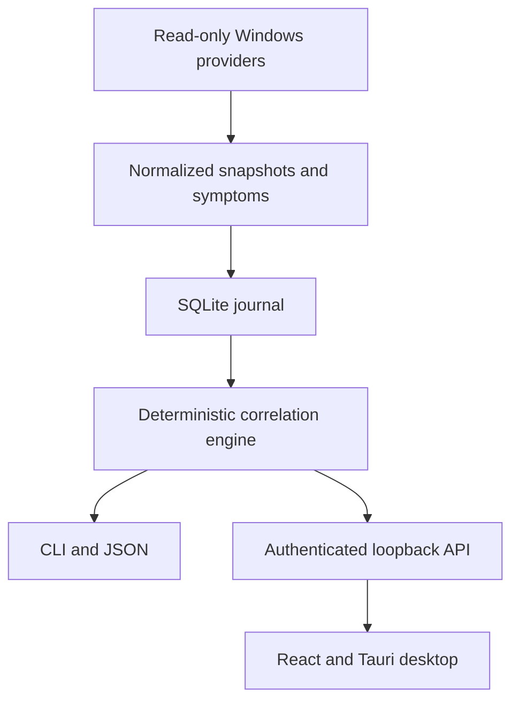

# Architecture and trust boundaries

Difftrail separates collection, storage, diagnosis, and presentation so the
diagnostic result remains local and reproducible. The Python engine is the
source of truth; the desktop interface is a client of a narrow local API.

## Major components

| Component | Responsibility | Important boundary |
| --- | --- | --- |
| `difftrail/collectors/` | Read Windows inventory and Event Log providers, then normalize records | Provider failures must remain visible; collectors do not remediate |
| `difftrail/db.py` | Versioned SQLite schema, snapshots, semantic events, investigations, retention | Writes are parameterized and migrations are transactional |
| `difftrail/correlation.py` | Rank candidate changes using explicit evidence and counter-evidence | Scores are deterministic ordering signals, not probabilities or proof of causality |
| `difftrail/privacy.py` | Redact profile paths and extract safe application labels | Redaction happens before normalized data crosses storage/UI/export boundaries |
| `difftrail/bundles.py` | Produce and validate one-way diagnostic reports | Raw messages, absolute paths, process IDs, and the SQLite file are excluded |
| `difftrail/ui_api.py` | Present a UI-safe local JSON contract and perform bounded mutations | Loopback bind, Host/Origin checks, request limits, and optional per-launch token |
| `ui/src-tauri/` | Start and supervise the packaged backend; build the current-user installer | The installed desktop generates the API token and owns the backend lifetime |
| `difftrail/automation.py` | Manage the opt-in watcher task and create local drafts/notifications | Observation only; task actions and expected arguments are validated |

## Data lifecycle

1. A scan reads supported Windows providers and reports any unavailable source.
2. The first successful source snapshot becomes a quiet baseline.
3. Later durable state differences become normalized change events. Supported
   Event Log records become symptom events.
4. SQLite stores normalized/redacted state locally. Raw Event Log message text
   is removed after the configured retention period while the compact event
   remains.
5. An investigation compares the reported onset with nearby changes and
   symptoms. Stable tie-breaking and explicit evidence produce reproducible
   output.
6. The UI receives a reduced public representation. Raw event details never
   cross the loopback API merely to render the interface.
7. An explicit export builds a new redacted JSON structure and validates it
   before writing atomically. Bundles cannot be imported into the journal.

## Process and privilege model

- Source development runs the Python engine selected by the developer.
- The installed Tauri shell starts bundled PyInstaller backend and watcher
  executables from its resource directory.
- Every installed-desktop launch generates a fresh 256-bit API token. It is
  passed to the child through its environment and returned only to the Tauri
  webview through an invoke command.
- The Python child binds port `0` first, then reports the OS-assigned port to
  Tauri through its private stdout pipe. Tauri never sends the token to a port
  that was selected and released before the backend owned it.
- The API listens only on loopback. Token authentication, Host validation,
  Origin allowlisting, JSON content-type checks, and bounded bodies protect
  state-changing routes.
- Background collection is opt-in. It uses a current-user scheduled task whose
  executable, database argument, repetition, and one-shot worker shape are
  checked before Difftrail reports it healthy.
- Uninstall stops Difftrail processes and removes the scheduled task. The local
  journal is deliberately preserved.

## Failure behavior

- One unavailable collector makes a scan partial; it does not turn missing
  coverage into a clean result.
- SQLite initialization and migrations either commit completely or roll back.
- A stale interrupted scan is reported by `doctor`; recovery is explicit.
- Weak or incomplete evidence produces `insufficient_evidence`,
  `no_recent_changes`, or `limited_coverage` rather than a confident answer.
- Desktop backend startup failures are recorded locally without including the
  journal contents.

## Validation strategy

The test suite covers pure ranking behavior, scanner-backed Windows-shaped
fixtures, migrations, privacy redaction, loopback HTTP guards, Task Scheduler
argument construction, bundle validation, and release metadata. Windows CI also
builds and silently installs/uninstalls the NSIS package.

Synthetic validation demonstrates behavior for known inputs. It is not evidence
of real-world diagnostic accuracy. The remaining host evidence is tracked in the
[v0.1.4 field-validation checklist](v0.1.4-field-validation.md).
